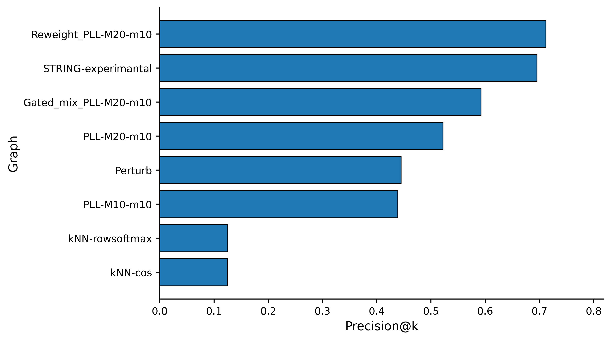
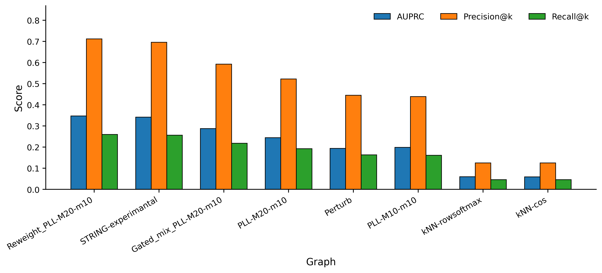
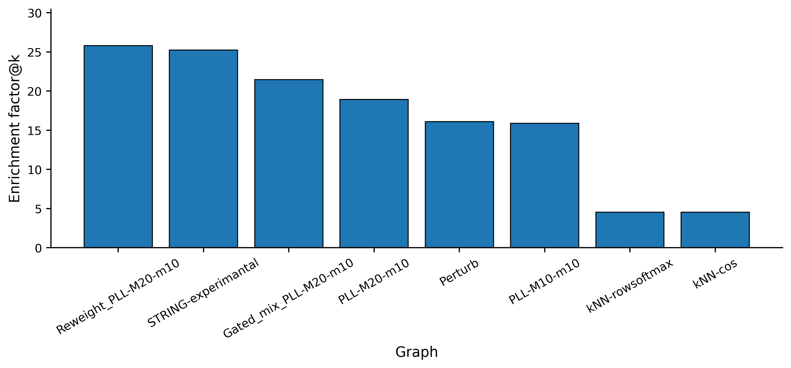
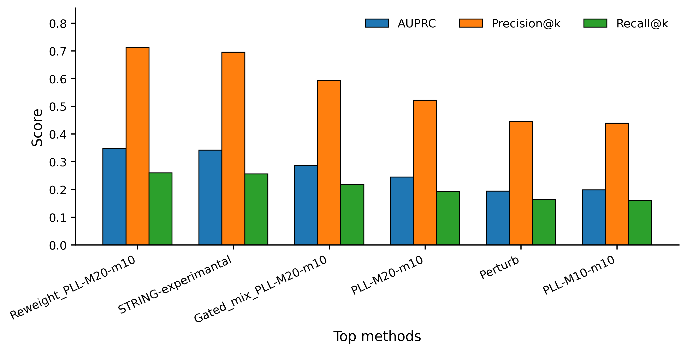

# Protein foundation models for predicting interaction signals in biomolecular assemblies

This repo use protein sequence FM to provide useful biological signals for recovering proteins belonging to biomolecular condensate assemblies.

Using large protein language models (ESM2/ProtT5), model-internal signals such as pseudo-log-likelihood differences and perturbation responses is extracted. These signals are integrated with STRING network, to estimate interaction propensity between proteins.

Goal is to evaluate whether FM representations encode functional interaction signals that can recover proteome from actual proteomic-MS.

---

# Pipeline

---

## 1. Protein embedding

Begin with STRING *homo sapiens* protein universe (~19k Pr), each protein sequence is encoded with ESM2/ProtT5 to construct PPI graphs.

---

## 2. Construct interaction propensity graphs

Build unsupervised weighted graphs with:

- Pseudo-log-likelihood difference under masked language modeling.

- Perturb coupling by masking residues in one sequence and measure Δlog-probability of another sequence.

- Cross-block attention signals when concatenating sequence pairs (optional).

Edge weights represent interaction propensity proxies, not direct physical binding predictions.

---

## 3. Fuse with STRING network

Integrate signals with STRING database in 2 ways:

- Use FM propensity to gate STRING edge weights.

- Combine gated STRING edges with FM-derived edges.

The goal is to preserve experimentally supported network structure while allowing FM signals to calibrate interaction confidence.

---

## 4. Diffusion ranking from seed proteins

Protein retrieval is performed using personalized PageRank with seed protein nodes, and ranking is performed on each source of PPI graphs.

---

## 5. Validation with condensate proteomic-MS

Validate against actual proteomic MS enrichment data from biomolecular condensate pull-down experiments. Positive proteins are defined with FDR and q-value threshold.

---

# Results Summary

Dataset:

- Protein universe: ~19,699
- Seed proteins: *homo sapiens* SRC1, FNBP1, FNBP1L, TRIP10
- Positive proteins (MS hits): 543

| Graph / Method | AUPRC | Precision@200 | Recall@200 | Enrichment Factor@200 |
|---|---:|---:|---:|---:|
| Reweight (PLL-M20-m10) | 0.347 | 0.712 | 0.260 | 25.79× |
| STRING experimental (baseline) | 0.342 | 0.696 | 0.256 | 25.23× |
| Gated mix (PLL-M20-m10) | 0.288 | 0.592 | 0.218 | 21.48× |
| FM-only PLL (M20-m10) | 0.245 | 0.522 | 0.192 | 18.94× |
| FM-only PLL (M10-m10) | 0.199 | 0.439 | 0.161 | 15.89× |
| FM-only Perturb (M40-m20) | 0.194 | 0.445 | 0.164 | 16.11× |
| FM-SIM kNN (row-softmax) | 0.060 | 0.125 | 0.046 | 4.53× |
| FM-SIM kNN (cos+) | 0.059 | 0.125 | 0.046 | 4.53× |

---

# Key Observations

STRING network already provides a strong baseline for assembly retrieval. FM-derived graphs contain meaningful interaction propensity information but are weaker than STRING alone. Using FM signals to reweight STRING edges yields modest improvements. 

In contrast, similarity-based kNN graphs perform poorly, suggesting that interaction propensity signals carry more useful information than global sequence similarity for this task.

---

# Figures

## Precision@k comparison

---

## Main metric comparison

---

## Enrichment factor ranking

---

## Top method comparison

---